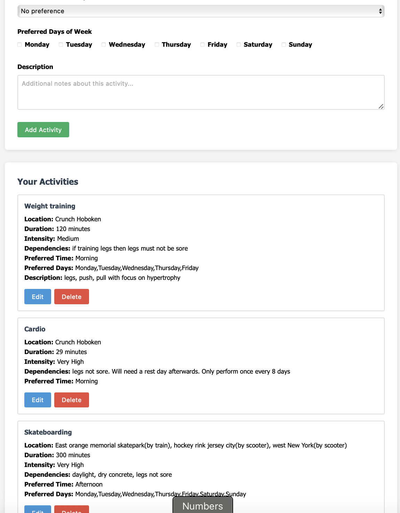
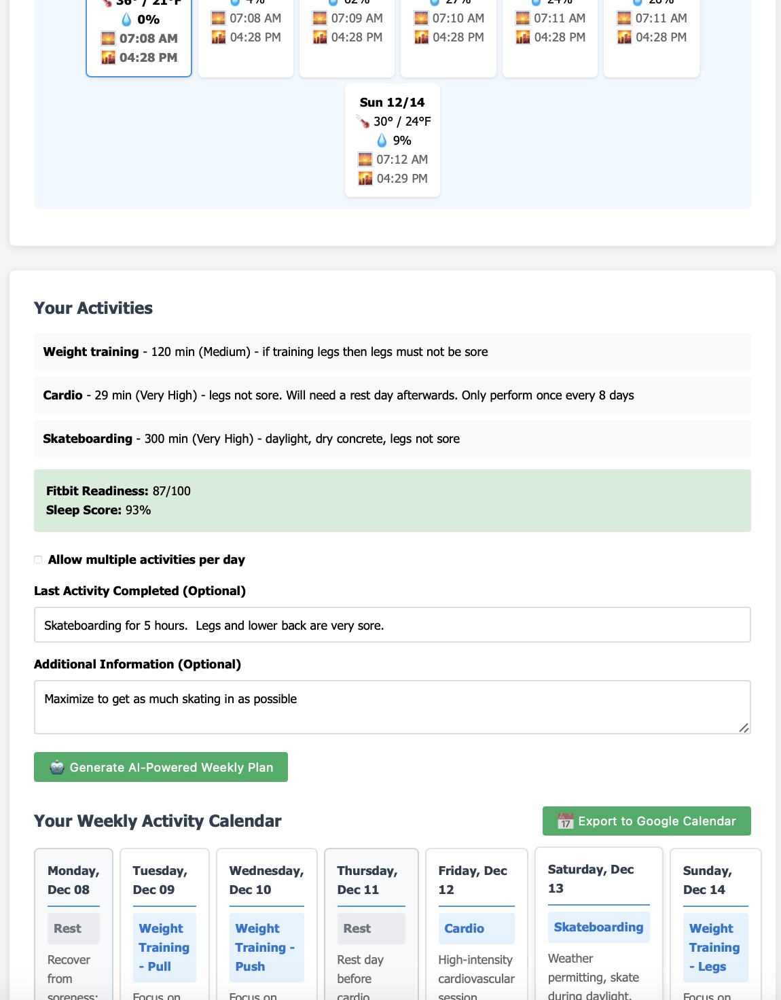

# Ai Activity Planner - Gregory Yampolsky

Hi and welcome to my GitHub repository for the Ai Activity Planner project! The goal of this project is to build an AI tool that helps you plan your activities based on the weather.

link to the site: https://ai-activity-planner-300000255718.us-central1.run.app

 

This project has a separate repository [Ai Activity Planner](https://github.com/gyampols/Ai-Activity-Planner/tree/main)

AI Activity Planner helps you maintain a balanced and active lifestyle by intelligently scheduling your favorite activities throughout the week. Whether you're into running, yoga, swimming, or any other activity, our AI-powered system creates personalized plans that consider your preferences, fitness levels, and schedule constraints.

